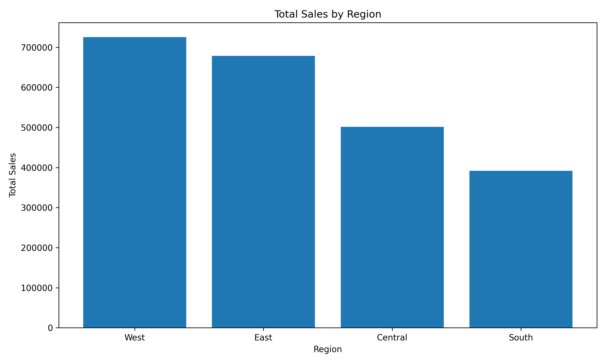
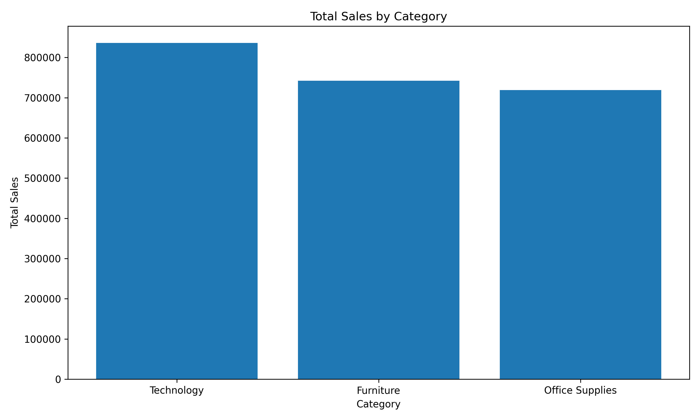
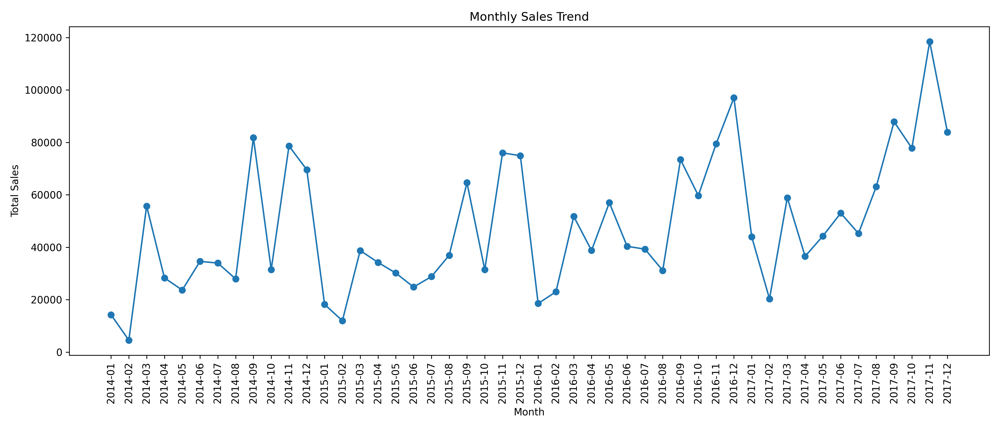

# Sales Analytics Dashboard

A business intelligence and analytics project for analyzing Superstore sales data using Python, SQL, SQLite, and data visualization.

This project demonstrates an end-to-end analytics workflow: data loading, data cleaning, SQL database creation, KPI extraction, regional/category analysis, monthly trend analysis, and dashboard-ready outputs.

---

## Project Overview

Sales analytics helps businesses understand revenue performance, profitability, product contribution, customer behavior, and regional differences.

This project analyzes the Superstore sales dataset and produces business KPIs, SQL query outputs, and visualizations that can be used as the foundation for a Power BI or BI dashboard.

The project includes:

- Data loading with Python
- Data cleaning and date parsing
- Feature creation for time-based analysis
- SQLite database creation
- SQL KPI queries
- Sales and profit analysis
- Regional analysis
- Category analysis
- Monthly sales trend analysis
- Top product analysis
- Dashboard-ready CSV outputs
- Result visualizations

---

## Dataset

The project uses a Superstore sales dataset.

The raw dataset contains:

| Metric | Value |
|---|---:|
| Rows | 9,994 |
| Columns | 21 |
| Missing values | 0 |

Main columns include:

- Order ID
- Order Date
- Ship Date
- Ship Mode
- Customer ID
- Customer Name
- Segment
- Country
- City
- State
- Postal Code
- Region
- Product ID
- Category
- Sub-Category
- Product Name
- Sales
- Quantity
- Discount
- Profit

The raw dataset is excluded from GitHub using `.gitignore`.

---

## Project Structure

```text
sales-analytics-dashboard/
│
├── data/
│   ├── raw/
│   └── processed/
│
├── results/
│   ├── figures/
│   │   ├── sales_by_region.png
│   │   ├── sales_by_category.png
│   │   └── monthly_sales_trend.png
│   │
│   ├── main_kpis.csv
│   ├── sales_by_region.csv
│   ├── sales_by_category.csv
│   ├── monthly_sales_trend.csv
│   └── top_products_by_sales.csv
│
├── sql/
│   └── sales_kpi_queries.sql
│
├── src/
│   ├── __init__.py
│   ├── config.py
│   ├── data_loader.py
│   ├── cleaning.py
│   ├── database.py
│   ├── analysis.py
│   └── visualization.py
│
├── .gitignore
├── main.py
├── README.md
└── requirements.txt
```

---

## Methodology

### 1. Data Loading

The raw Superstore CSV file is loaded using Python and Pandas.

The loader also handles encoding issues and removes unwanted characters from column names.

---

### 2. Data Cleaning

The cleaning pipeline performs the following steps:

- Standardizes column names
- Converts date columns into datetime format
- Converts numeric columns into numeric types
- Removes duplicate rows
- Creates time-based features
- Calculates profit margin

Created features:

```text
order_year
order_month
order_year_month
profit_margin
```

---

### 3. SQLite Database Creation

After cleaning, the dataset is saved into a SQLite database:

```text
sales_analytics.db
```

The cleaned data is stored in the table:

```text
sales
```

This allows SQL-based analysis and makes the project closer to a real business analytics workflow.

---

### 4. SQL KPI Analysis

The project includes SQL queries for:

- Main business KPIs
- Sales and profit by region
- Sales and profit by category
- Monthly sales and profit trend
- Top products by sales
- Top products by profit
- Least profitable products
- Customer segment analysis
- Discount impact on profit
- State-level sales and profit

SQL queries are stored in:

```text
sql/sales_kpi_queries.sql
```

---

## Main KPIs

| KPI | Value |
|---|---:|
| Total Sales | 2,297,200.86 |
| Total Profit | 286,397.02 |
| Total Orders | 5,009 |
| Total Customers | 793 |
| Profit Margin | 12.47% |

---

## Sales by Region

| Region | Total Sales | Total Profit | Total Orders | Profit Margin |
|---|---:|---:|---:|---:|
| West | 725,457.82 | 108,418.45 | 1,611 | 14.94% |
| East | 678,781.24 | 91,522.78 | 1,401 | 13.48% |
| Central | 501,239.89 | 39,706.36 | 1,175 | 7.92% |
| South | 391,721.91 | 46,749.43 | 822 | 11.93% |

---

## Sales by Category

| Category | Total Sales | Total Profit | Profit Margin |
|---|---:|---:|---:|
| Technology | 836,154.03 | 145,454.95 | 17.40% |
| Furniture | 741,999.80 | 18,451.27 | 2.49% |
| Office Supplies | 719,047.03 | 122,490.80 | 17.04% |

---

## Top Products by Sales

| Rank | Product | Category | Sub-Category | Sales | Profit |
|---:|---|---|---|---:|---:|
| 1 | Canon imageCLASS 2200 Advanced Copier | Technology | Copiers | 61,599.82 | 25,199.93 |
| 2 | Fellowes PB500 Electric Punch Plastic Comb Binding Machine | Office Supplies | Binders | 27,453.38 | 7,753.04 |
| 3 | Cisco TelePresence System EX90 Videoconferencing Unit | Technology | Machines | 22,638.48 | -1,811.08 |
| 4 | HON 5400 Series Task Chairs for Big and Tall | Furniture | Chairs | 21,870.58 | 0.00 |
| 5 | GBC DocuBind TL300 Electric Binding System | Office Supplies | Binders | 19,823.48 | 2,233.51 |

---

## Business Insights

### 1. West is the strongest region by sales

The West region generated the highest sales and profit.

Business recommendation:

- Continue investing in the West region.
- Study successful regional strategies and apply them to weaker regions.

---

### 2. Central has weaker profitability

Central has significant sales volume but the lowest profit margin among the regions.

Business recommendation:

- Investigate discounting, product mix, and operational costs in the Central region.
- Reduce low-margin campaigns and improve pricing strategy.

---

### 3. Technology is the strongest category

Technology generated the highest sales and highest profit.

Business recommendation:

- Prioritize technology products in marketing campaigns.
- Expand high-margin technology product lines.

---

### 4. Furniture has weak profit margin

Furniture has high sales but very low profit margin.

Business recommendation:

- Review furniture discounts and shipping costs.
- Identify unprofitable furniture sub-categories.
- Improve pricing and inventory strategy.

---

### 5. Some high-sales products are not profitable

Some products with strong sales still generate negative profit.

Business recommendation:

- Monitor product-level profitability, not only revenue.
- Reduce discounts on loss-making products.
- Remove or reprice consistently unprofitable products.

---

## Result Visualizations

### Sales by Region



### Sales by Category



### Monthly Sales Trend



---

## How to Run

## Power BI Dashboard

An interactive Power BI dashboard was created to visualize the main sales KPIs and business insights.

Dashboard components include:

- Total Sales
- Total Profit
- Profit Margin
- Total Orders
- Total Customers
- Monthly Sales Trend
- Sales by Region
- Profit Margin by Category
- Top Products by Sales
- Key Business Insights

Power BI file:

```text
powerbi/superstore_sales_dashboard.pbix

### 1. Clone the repository

```bash
git clone https://github.com/Zahra-ziaee/sales-analytics-dashboard.git
cd sales-analytics-dashboard
```

### 2. Create and activate a virtual environment

Windows PowerShell:

```bash
python -m venv .venv
.venv\Scripts\Activate.ps1
```

### 3. Install dependencies

```bash
pip install -r requirements.txt
```

### 4. Add the dataset

Place the raw Superstore CSV file here:

```text
data/raw/superstore.csv
```

### 5. Run the project

```bash
python main.py
```

---

## Outputs

Running the project generates:

```text
data/processed/superstore_cleaned.csv

sales_analytics.db

results/main_kpis.csv
results/sales_by_region.csv
results/sales_by_category.csv
results/monthly_sales_trend.csv
results/top_products_by_sales.csv

results/figures/sales_by_region.png
results/figures/sales_by_category.png
results/figures/monthly_sales_trend.png
```

---

## SQL Queries

The SQL file contains reusable KPI queries:

```text
sql/sales_kpi_queries.sql
```

Example KPI query:

```sql
SELECT
    ROUND(SUM(sales), 2) AS total_sales,
    ROUND(SUM(profit), 2) AS total_profit,
    COUNT(DISTINCT order_id) AS total_orders,
    COUNT(DISTINCT customer_id) AS total_customers,
    ROUND(SUM(profit) / SUM(sales), 4) AS profit_margin
FROM sales;
```

---

## Current Status

Completed:

- Data loading
- Data cleaning
- Date parsing
- Feature creation
- SQLite database creation
- SQL KPI queries
- Sales KPI analysis
- Regional analysis
- Category analysis
- Monthly trend analysis
- Top product analysis
- CSV output generation
- Result visualizations
- GitHub project setup

Planned next steps:

- Build Power BI dashboard
- Add customer segment analysis charts
- Add discount vs profit analysis
- Add state-level profitability map
- Add dashboard screenshots to README

---

## Technologies Used

- Python
- Pandas
- NumPy
- Matplotlib
- SQLite
- SQL
- Git
- GitHub

---

## Author

Zahra Ziaee

Focus: Sales Analytics, Business Intelligence, SQL, Dashboarding, and Data-Driven Decision Making